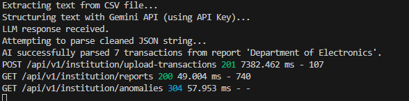
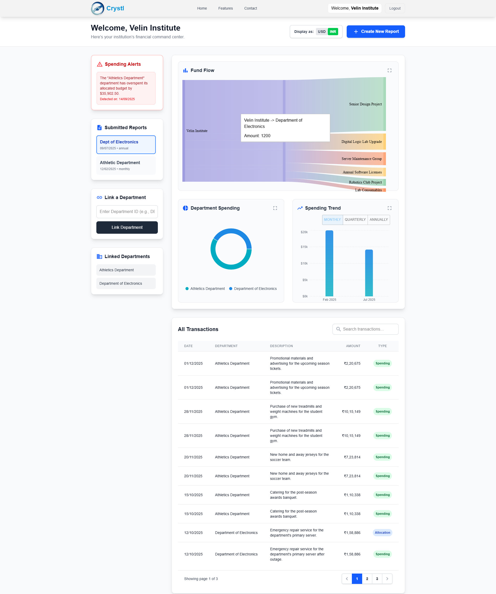
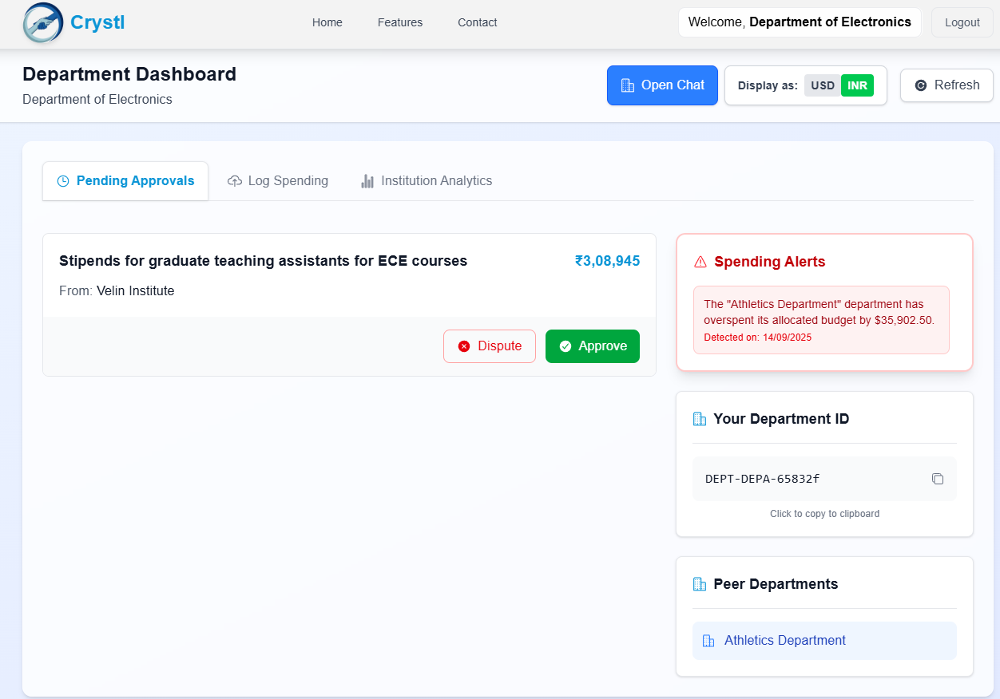
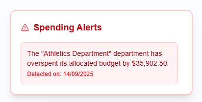
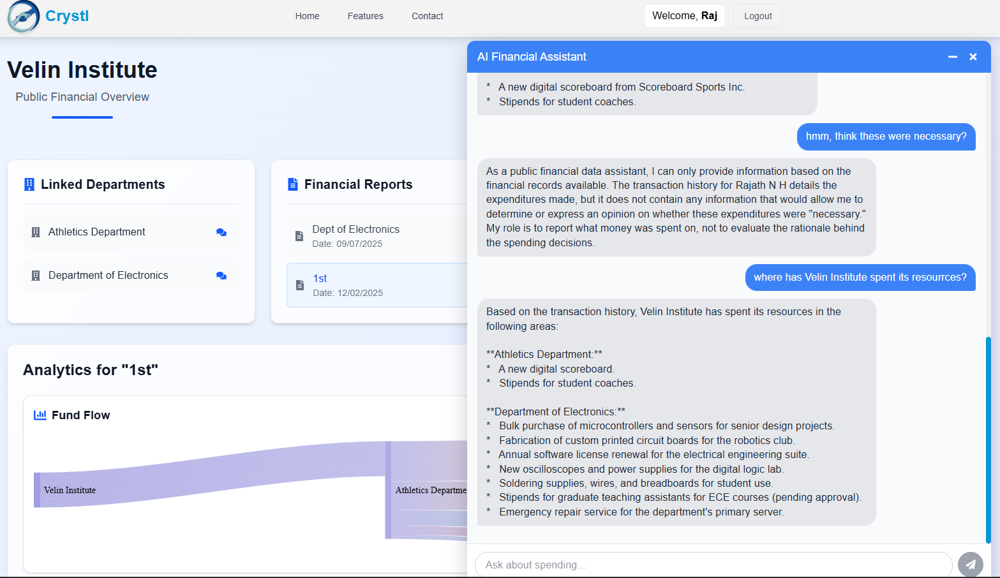
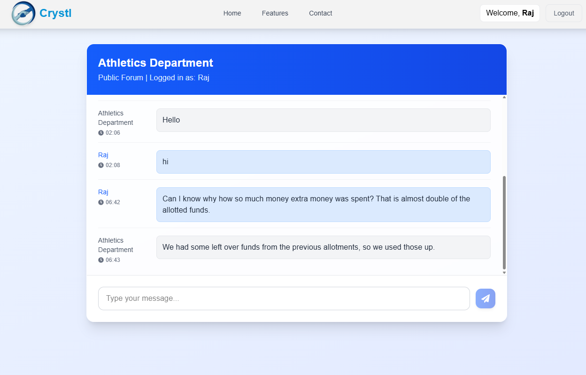
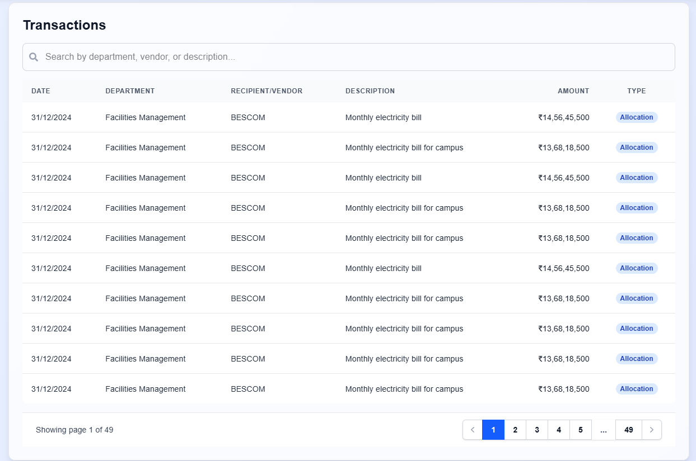

# Crystl: AI-Powered Financial Transparency


[](https://reactjs.org/)
[](https://nodejs.org/)
[](https://www.mongodb.com/)
[](https://cloud.google.com/ai)

**Crystl is a full-stack platform built for the "Bit N Build" hackathon to solve the critical challenge of financial opacity. It's a multi-tenant ecosystem designed to automate data ingestion, provide clarity through visualization, and foster public trust through a verifiable, two-party approval system.**

---

### 🚀 Live Demo & Video

**Watch our video presentation to see Crystl in action!**

<!--
    INSERT YOUR YOUTUBE/LOOM VIDEO LINK HERE
    Example:
    [](https://www.youtube.com/watch?v=your-video-id)
-->

---

## The Problem

Financial data in institutions is often trapped in complex spreadsheets, dense PDFs, and siloed departments. This lack of clarity makes it difficult to track the flow of money, creates opportunities for misuse, and leaves stakeholders like citizens, students, and donors completely in the dark. How can we trust numbers that are hard to access, difficult to understand, and impossible to verify?

## Our Solution: The "Crystl" Ecosystem

Crystl tackles this problem with a three-pronged approach: **Automate**, **Verify**, and **Visualize**. We built a comprehensive platform with distinct, tailored experiences for every stakeholder.

### Key Features Implemented

#### 🤖 1. AI-Powered Data Ingestion Engine
We eliminated the #1 barrier to transparency: manual data entry. Our intelligent pipeline automates the entire process.
- **Upload Anything:** Institutions can upload raw financial documents as **CSVs or even unstructured PDFs**.
- **Intelligent Structuring:** We use **Google Cloud Vision API** for OCR and the **Gemini LLM** to intelligently parse documents, identify transactions, and structure messy data into a clean, usable format.
- **Automated Routing:** The structured data is then routed to the correct departments for verification.

<p align="center">
  
  &nbsp;
  
</p>

---

#### 📊 2. Advanced Analytics & Visualization Suite
Data is useless if you can't understand it. Our public-facing dashboards turn complex numbers into intuitive stories.
- **Multi-Level Fund Flow:** Interactive **Sankey diagrams** visualize the complete journey of funds from the institution down to the final vendor.
- **Spending Breakdowns:** **Pie and Bar charts** provide instant insights into spending by department and track trends over time.
- **Granular Transaction Log:** A fully searchable and paginated table provides ultimate detail.

<p align="center">
  
</p>

---

#### ✅ 3. Two-Party Verification Workflow
To ensure data accuracy, nothing is accepted blindly.
- **Pending Approvals:** Allocations created by an institution appear in the respective department's dashboard as "pending".
- **Approve or Dispute:** Departments must digitally approve every transaction, creating a human-level check and balance.

<p align="center">
  
</p>

---

#### 🏆 4. The Winning Edge: Bonus Features Showcase
We went above and beyond to deliver a complete, user-centric solution.

| Anomaly Detection | AI Financial Assistant |
| :---: | :---: |
|  |  |
| **Community Feedback Forum** | **Multi-Currency Support (USD/INR)** |
|  |  |

---

## Tech Stack

| Area      | Technologies                                                                 |
|-----------|------------------------------------------------------------------------------|
| **Frontend**  | React, Vite, Tailwind CSS, Material-UI, Recharts, `react-router-dom`, Axios |
| **Backend**   | Node.js, Express, MongoDB, Mongoose                                        |
| **AI & Cloud**| Google Gemini API, Google Cloud Vision API                                   |
| **Auth**      | JWT (JSON Web Tokens), `cookie-parser`, `bcryptjs`                           |
| **Deployment**| Vercel (Frontend), Google Cloud Run (Backend)                                |

## Getting Started

### Prerequisites
- Node.js (v20+)
- MongoDB Atlas account or local instance
- Google Cloud Platform account with Vision API and Gemini enabled
- `.env` file with necessary API keys and secrets

### Installation & Setup

1.  **Clone the repository:**
    ```bash
    git clone https://github.com/rajathnh/crystl.git
    cd crystl
    ```

2.  **Setup Backend:**
    ```bash
    cd backend
    npm install
    # Create a .env file from .env.example and add your variables
    npm run dev
    ```

3.  **Setup Frontend:**
    ```bash
    cd ../frontend
    npm install
    # Create a .env.local file and add your VITE_API_URL
    npm run dev
    ```

